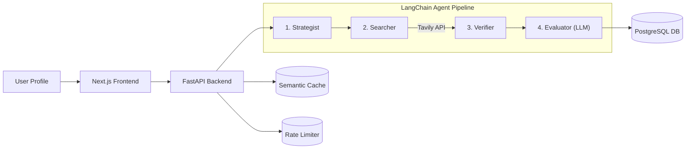

# 1waygo 🎯

> Hyper-personalized career opportunity discovery for engineering students, powered by FAANG-tier Agentic AI.


## What It Does
Opportunity Radar doesn't just search the web; it strategically evaluates your profile (Branch, Year, Interests, Career Goal) to find high-impact hackathons, internships, and research roles. It actively verifies every link to ensure deadlines haven't passed and automatically filters out roles you aren't eligible for.

## Architecture



## The Agent Pipeline
1. **Strategist** — Uses an LLM to generate highly targeted web queries specific to your exact year and branch, utilizing advanced search operators.
2. **Searcher** — Executes live web searches via the Tavily Search API.
3. **Verifier** — Concurrently pings every returned URL. It follows 301 redirects, drops 404 dead links, and applies regex heuristics to filter out expired dates (e.g., 2024 deadlines).
4. **Evaluator** — A final LLM pass that acts as a strict career advisor. It removes roles where you are ineligible (e.g., rejecting a 3rd-year student from a freshman program) and provides a personalized 1-sentence reason why you should apply.

## Tech Stack

| Component | Technology | Purpose |
| --- | --- | --- |
| **Frontend** | Next.js, TailwindCSS | Reactive UI with optimistic state updates |
| **Backend** | FastAPI, Python | High-performance async API |
| **AI/Agents** | LangChain, Google Gemini | LLM reasoning, structured output parsing |
| **Search** | Tavily API | Real-time web search |
| **Database** | PostgreSQL, SQLAlchemy, Alembic | Persistent storage of users and opportunities |
| **Caching/Limits** | Redis, FAISS | Semantic caching of similar profiles & rate limiting |

## Local Setup

### Backend
```bash
cd backend
python -m venv venv
# Windows
.\venv\Scripts\activate
# Mac/Linux
source venv/bin/activate

pip install -r requirements.txt

# Create .env based on .env.example and add your API keys
cp .env.example .env

# Run database migrations (SQLite by default locally)
alembic upgrade head

# Start the server
uvicorn app.main:app --reload
```

### Frontend
```bash
cd frontend
npm install
npm run dev
```
Navigate to `http://localhost:3000`.
